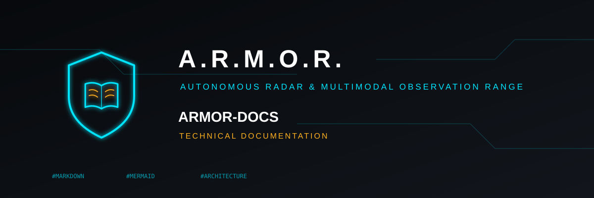
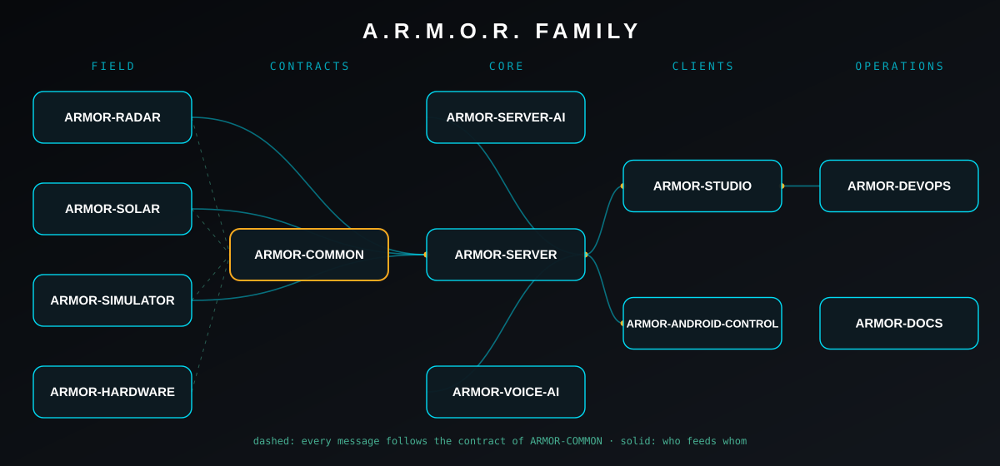

<p align="center">
  
</p>

# 📚 ARMOR-DOCS

<p align="center">
  <a href="README.md">🇺🇸 English</a> |
  <a href="README_spa.md">🇪🇸 Español</a> |
  🇫🇷 <b>Français</b> |
  <a href="README_ita.md">🇮🇹 Italiano</a> |
  <a href="README_deu.md">🇩🇪 Deutsch</a> |
  <a href="README_zho.md">🇨🇳 简体中文</a> |
  <a href="README_jpn.md">🇯🇵 日本語</a>
</p>

### Architecture canonique, base de sécurité et vérité sur ce qui est prouvé

<p align="center">
  
  
  
  
</p>

---

**Vérification d'honnêteté - ce qui fonctionne aujourd'hui:** Ce dépôt documente des interfaces et des procédures validées, et dit franchement ce qui ne l'est pas. Lisez la [matrice des capacités](docs/CAPABILITY_MATRIX.md) avant de croire qu'une fonction est « terminée » : elle indique pour chacune si elle a seulement été simulée, testée sur ordinateur ou vérifiée sur du vrai matériel.

---

## 🎯 Présentation

<p align="center">
  
</p>

* [Matrice des capacités](docs/CAPABILITY_MATRIX.md) : pour chaque capacité, simulée, locale ou vérifiée sur matériel ?
* [Architecture](docs/ARCHITECTURE.md) : réseaux, frontières de confiance, temps et ordre.
* [Base de sécurité](docs/SECURITY_BASELINE.md) : la conception des VLAN, ce que le code impose et ce qui manque encore.
* [Catalogue des projets](docs/PROJECT_CATALOG.md) : les douze dépôts, leurs versions et leurs dépendances.
* [Interfaces](docs/INTERFACES.md) : qui produit et consomme chaque interface et où on lui fait confiance.
* [Première tranche verticale](docs/FIRST_VERTICAL_SLICE.md) : ce que prouve le test du simulateur à la console et ce qu'il ne prouve pas.
* **Outils :** `make_readmes.py` écrit le README de chaque dépôt en sept langues, `make_brand.py` sa bannière et son icône, `publication_check.py` cherche tout élément privé avant une publication et `clean_history.py` fait une copie publiable d'un dépôt.

## 📂 Structure du dépôt

```text
ARMOR-DOCS/
├── docs/     CAPABILITY_MATRIX, ARCHITECTURE, SECURITY_BASELINE, PROJECT_CATALOG, INTERFACES, FIRST_VERTICAL_SLICE
├── tools/    make_readmes.py (+ readme_data/), make_brand.py, publication_check.py, clean_history.py, check_all.sh
├── brand/    the emblem
└── images/   this repository's banner and icon
```

## 🛠️ Environnement de développement

```bash
python tools/make_readmes.py --check      # the READMEs (7 languages) are current
python tools/make_brand.py --check        # the banners and icons are current
python tools/publication_check.py         # nothing private would leave with a publication
bash tools/check_all.sh                   # every repository's own tests, in one run
```

Les audits de la famille (en espagnol) se trouvent à la racine de ce dépôt.

## 🔗 Projets liés

**A.R.M.O.R.** (Autonomous Radar & Multimodal Observation Range) est un système de sécurité périmétrique composé de dépôts indépendants. Chacun a sa propre version, ses propres tests et son propre README ; voici la famille :

* **[ARMOR-COMMON](https://github.com/JuanenRac/ARMOR-COMMON)** - Contrats de messages, validateurs, vecteurs de conformité et types générés
* **[ARMOR-RADAR](https://github.com/JuanenRac/ARMOR-RADAR)** - Firmware du nœud de terrain pour ESP32-S3 avec trois radars et son propre panneau web
* **[ARMOR-SOLAR](https://github.com/JuanenRac/ARMOR-SOLAR)** - Protocoles des onduleurs et batteries solaires et messages d'un nœud passerelle
* **[ARMOR-ELECTRICAL](https://github.com/JuanenRac/ARMOR-ELECTRICAL)** - Nœud électrique : compteurs, le message des mesures du réseau et les règles de commutation
* **[ARMOR-HMI](https://github.com/JuanenRac/ARMOR-HMI)** - Panneau tactile : l'état du système sur un écran mural, armer et acquitter, et la maison de l'assistant vocal
* **[ARMOR-NETWORK](https://github.com/JuanenRac/ARMOR-NETWORK)** - Le réseau local : ses appareils, internet et ce qui change
* **[ARMOR-SERVER](https://github.com/JuanenRac/ARMOR-SERVER)** - Coordinateur central : télémétrie, alarmes, appareils, relevés solaires et caméras
* **[ARMOR-STUDIO](https://github.com/JuanenRac/ARMOR-STUDIO)** - Console web : caméras, radar, alarmes, énergie solaire et concepteur de site 2D/3D
* **[ARMOR-ANDROID-CONTROL](https://github.com/JuanenRac/ARMOR-ANDROID-CONTROL)** - Client Android de l'opérateur avec radar 2D/3D en direct
* **[ARMOR-SERVER-AI](https://github.com/JuanenRac/ARMOR-SERVER-AI)** - Politique d'inférence visuelle qui explique ses décisions et n'agit jamais
* **[ARMOR-VOICE-AI](https://github.com/JuanenRac/ARMOR-VOICE-AI)** - Intentions vocales hors ligne avec une confirmation impossible à falsifier
* **[ARMOR-HARDWARE](https://github.com/JuanenRac/ARMOR-HARDWARE)** - Boîtiers, électronique et matrice d'acceptation sur banc
* **[ARMOR-DEVOPS](https://github.com/JuanenRac/ARMOR-DEVOPS)** - Déploiement, banc d'essai CM5, sauvegarde et TLS
* **[ARMOR-SIMULATOR](https://github.com/JuanenRac/ARMOR-SIMULATOR)** - Simulateur de télémétrie hors ligne avec des pannes reproductibles
* **[ARMOR-UPDATER](https://github.com/JuanenRac/ARMOR-UPDATER)** - Détecte, installe et met à jour les propres dépôts de l'écosystème
* **ARMOR-DOCS** (ce dépôt) - Architecture, base de sécurité et matrice des capacités

## 📚 Documentation et communauté

Pour en savoir plus :

* [Matrice des capacités : ce qui est prouvé et ce qui ne l'est pas](docs/CAPABILITY_MATRIX.md)
* [Catalogue des projets : versions et dépendances entre les dépôts](docs/PROJECT_CATALOG.md)
* [Historique des modifications de ce dépôt](CHANGELOG.md)
* [Licence (GPL-3.0-or-later)](LICENSE)
* Questions, idées et rapports : electrohobby3d@gmail.com

## 👤 AUTEUR

**JuanenRac (Electro Hobby 3D)** · electrohobby3d@gmail.com

## 📜 LICENCE

GPL-3.0-or-later - voir [LICENSE](LICENSE).
