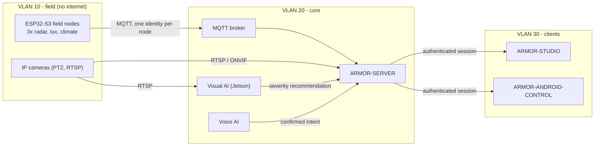

# A.R.M.O.R. architecture

## Trust boundaries

* **Field nodes** publish observations and health. Each has its own broker identity and can
  write only its own topics; the broker is the boundary, and the server validates every payload
  again against the published contract. A node never receives an instruction it can execute
  without an allow-listed command.
* **The server is the only place that touches a camera.** No client receives a camera password
  or an RTSP address. Clients get JSON, MJPEG and files through an HttpOnly session.
* **The AI services recommend, they never act.** The visual policy returns a severity with
  reasons and `authorizes_action = false`; the voice service returns an intent and needs a
  service-issued confirmation for arm and disarm. The server authenticates and authorises
  every action.
* **Studio and Android are clients of the server**, not of the field network. They never reach
  a node's own configuration endpoint.

## Time and ordering

Every message carries a wall-clock millisecond timestamp (SNTP on the node). The server ignores
a newer-than-received "online" message that is older than the last one it holds, always applies an
"offline" message (an MQTT last will cannot know the time of its own death) and never moves a node's
stored time backwards. A node that stops talking is shown *stale* and *offline* after a
configurable silence.

## Where each concern lives

| Concern | Project |
|---|---|
| What a message means | ARMOR-COMMON (JSON Schemas, conformance vectors, generated types, OpenAPI) |
| Sensing and field firmware | ARMOR-RADAR |
| State, cameras, evidence, audit | ARMOR-SERVER |
| Visual and voice decisions | ARMOR-SERVER-AI, ARMOR-VOICE-AI |
| Operator consoles | ARMOR-STUDIO, ARMOR-ANDROID-CONTROL |
| Enclosures and electronics | ARMOR-HARDWARE |
| Deployment | ARMOR-DEVOPS |
| Offline testing and faults | ARMOR-SIMULATOR |

See the [capability matrix](CAPABILITY_MATRIX.md) for what is simulated, local or verified.
